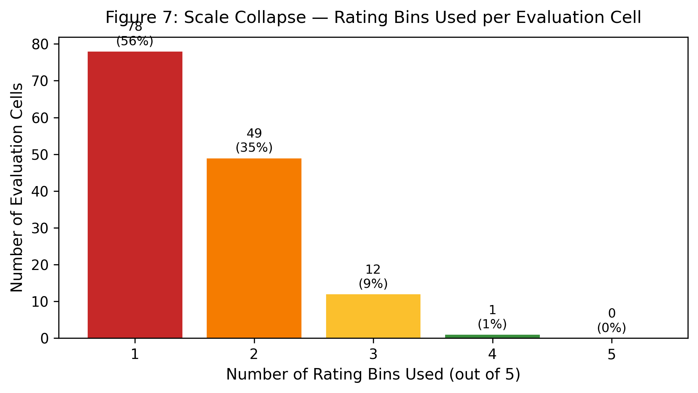
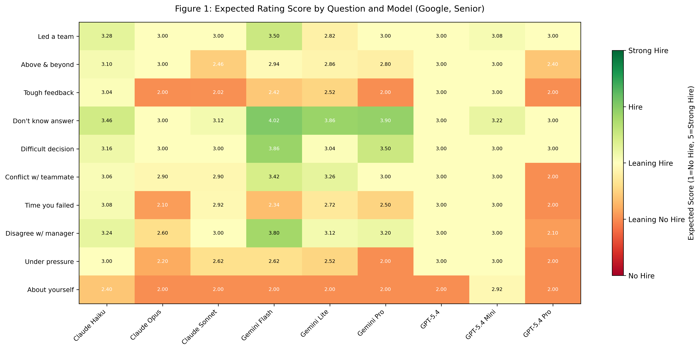
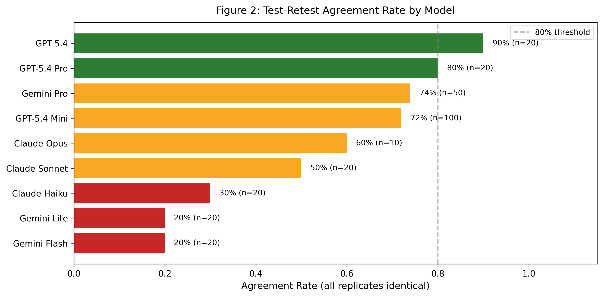
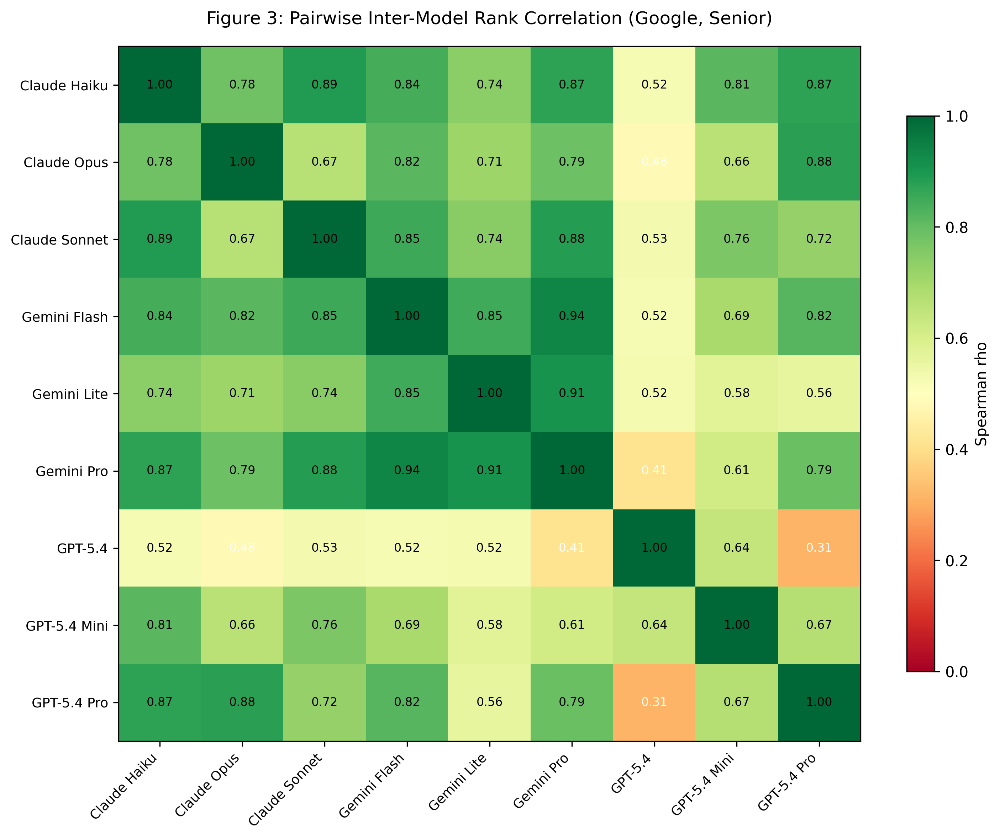
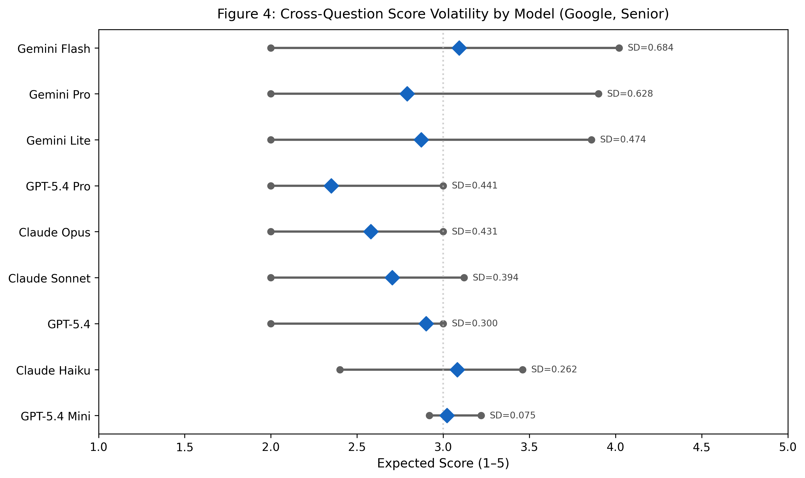
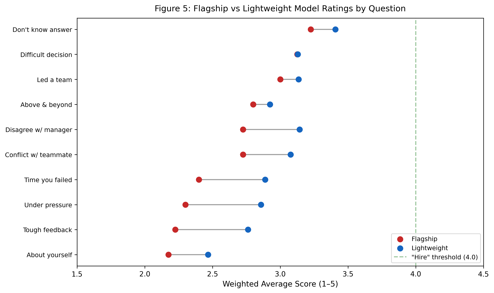
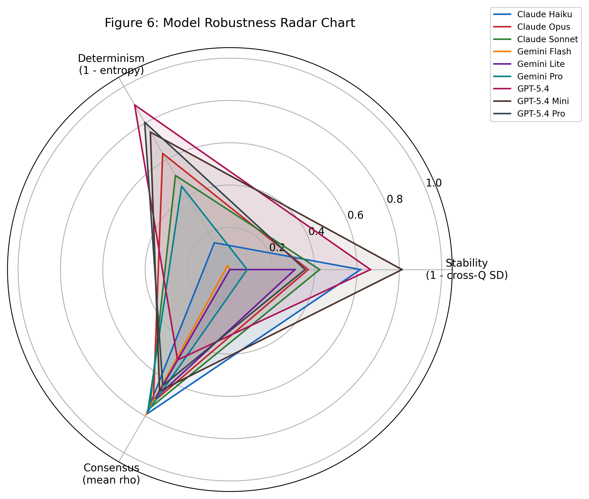

# Scale Collapse, Model Disagreement, and False Precision: A Multi-Model Audit of LLM Behavioral Interview Scoring

**Authors:** Kewen Zhu, Ze Sheng, Zixi Liu, Junyuan Tan

## Abstract

Large Language Models (LLMs) are increasingly deployed as hiring evaluators, yet no systematic reliability audit exists for this high-stakes domain. We benchmark 9 frontier models from 3 families (GPT-5.4, Claude, Gemini) across 10 behavioral questions, 3 companies, and 2 seniority levels (141 cells, 10–50 samples each, 4,600 total ratings), revealing five reliability failures: (1) **Scale collapse** — a 5-point scale degenerates into 2.03 effective categories (normalized entropy = 0.44); (2) **Test-retest unreliability** — ICC(2,1) ranges from 0.16 to 0.85 across models; (3) **Inter-model disagreement** — Krippendorff's α = 0.52, below the 0.67 tentative-conclusion threshold, with same-brand variants (Spearman ρ = 0.25) disagreeing more than cross-vendor pairs (ρ = 0.87); (4) **Question-type sensitivity** — identical answers receive ratings differing by 2 ordinal grades across question types; (5) **Expectation gap** — community-endorsed answers score below "Hire" across all models, with flagship models significantly harsher than lightweight (Wilcoxon *z* = −2.80, *p* = .005). We propose a minimum reliability checklist and discuss implications for AI hiring policy.

**Keywords:** LLM Evaluation Reliability, AI-Assisted Hiring, Behavioral Interviews, Multi-Model Benchmark, Algorithmic Auditing, Scale Collapse

---

## 1. Introduction

### 1.1 Background: The Rise of AI in Hiring

Artificial intelligence is rapidly transforming hiring practices. An estimated 99% of Fortune 500 companies now use AI-powered tools somewhere in their recruitment pipeline, and 90% of large employers use automated systems to filter job applications ([AllAboutAI, 2025](#ref-allaboutai-2025)). SHRM's 2024 Talent Trends Survey found that among organizations using AI for HR, 64% apply it to recruitment, interviewing, and hiring — the leading use case ([Society for Human Resource Management, 2024](#ref-shrm-2024)). Products like HireVue, Pymetrics, and numerous startup offerings promise to evaluate candidates at scale using Large Language Models (LLMs). The appeal is clear: consistent evaluation, reduced human bias, faster throughput, and lower cost per assessment.

The behavioral interview — in which candidates describe past experiences demonstrating competencies such as leadership, conflict resolution, and problem-solving — is a cornerstone of hiring at major technology companies including Google, Meta, and Amazon. These companies employ structured rubrics to evaluate behavioral answers on ordinal scales, making them a natural target for LLM-based automation.

### 1.2 The Missing Audit

Despite rapid deployment, a critical gap exists: **no systematic reliability audit has been conducted on LLM behavioral interview evaluators**. This stands in stark contrast to other high-stakes AI applications:

- Medical AI systems require FDA clearance and clinical validation before deployment
- Financial AI models undergo rigorous backtesting and stress testing
- Criminal justice risk assessment tools face increasing scrutiny and auditing requirements

Yet AI hiring tools — which directly affect people's livelihoods — operate with minimal reliability benchmarking. The few existing studies focus on single-model evaluations or narrow prompt engineering without addressing fundamental questions of measurement reliability.

### 1.3 Research Questions

We address three core questions:

1. **Scale utilization**: Do LLM evaluators effectively use the full range of hiring rating scales, or does the scale degenerate under automated evaluation?
2. **Reliability**: How consistent are LLM hiring ratings across repeated evaluations (test-retest) and across different models (inter-rater)?
3. **Validity**: Do LLM ratings align with community expectations for behavioral interview answer quality?

### 1.4 Contributions

This work makes the following contributions:

1. **The first multi-model behavioral interview scoring benchmark**, spanning 9 frontier models, 3 model families, 3 companies, 2 seniority levels, and 10 behavioral questions, with up to 50 repeated samples per evaluation cell.

2. **Five empirically validated reliability failures** in LLM interview scoring: scale collapse, test-retest unreliability, inter-model disagreement, question-type sensitivity, and expectation gap.

3. **A model robustness scorecard** demonstrating that stability (self-consistency) and consensus (inter-model agreement) are orthogonal dimensions — no single model excels on all reliability axes.

4. **A minimum reliability checklist** for deploying LLM interview evaluators, informed by our empirical findings.

5. **Open-source evaluation framework** enabling reproducible auditing of LLM interview scoring systems.

### 1.5 Paper Organization

Section 2 reviews related work. Section 3 describes our experimental design. Section 4 presents our five core findings. Section 5 introduces the model robustness scorecard. Section 6 proposes the reliability checklist and discusses implications. Section 7 acknowledges limitations. Section 8 concludes.

---

## 2. Related Work

### 2.1 LLM-as-Judge

The paradigm of using LLMs as evaluators has gained significant traction. [Zheng et al. (2023)](#ref-zheng-2023) introduced MT-Bench and Chatbot Arena for evaluating conversational AI using LLM judges. [Liu et al. (2023)](#ref-liu-2023) proposed G-Eval, demonstrating that GPT-4 evaluations correlate with human judgments for text generation quality. However, these works focus on general NLG evaluation rather than domain-specific, high-stakes assessment.

Recent studies have identified systematic biases in LLM judges, including leniency bias ([Wang et al., 2024](#ref-wang-2024)), position bias ([Zheng et al., 2023](#ref-zheng-2023)), and verbosity bias ([Saito et al., 2023](#ref-saito-2023)). Our work extends this line of inquiry to the hiring domain, where such biases have direct consequences for candidates and employers.

### 2.2 AI in Hiring

Automated hiring systems have evolved from keyword-matching resume screeners to sophisticated multi-modal assessment platforms. HireVue (now part of the broader AI hiring ecosystem) processes millions of video interviews annually. Academic work has explored automated interview scoring ([Naim et al., 2018](#ref-naim-2018); [Hemamou et al., 2019](#ref-hemamou-2019)) and feedback generation ([Hoque et al., 2013](#ref-hoque-2013)).

However, the reliability of these systems remains underexplored. [Raghavan et al. (2020)](#ref-raghavan-2020) surveyed AI hiring tools and found a lack of validation evidence. [Wilson et al. (2021)](#ref-wilson-2021) highlighted fairness concerns in AI hiring but did not conduct systematic reliability auditing. Our work fills this gap with the first multi-model reliability benchmark specifically for behavioral interview evaluation.

### 2.3 Evaluation Reliability in Psychology

The psychometric tradition provides a rigorous framework for evaluating measurement instruments. Key reliability dimensions include:

- **Test-retest reliability**: Consistency of scores across repeated measurements ([Cronbach, 1951](#ref-cronbach-1951))
- **Inter-rater reliability**: Agreement among different raters evaluating the same subject ([Shrout & Fleiss, 1979](#ref-shrout-1979))
- **Internal consistency**: Coherence of items within a scale ([McDonald, 1999](#ref-mcdonald-1999))

We adapt these classical reliability frameworks to the LLM evaluation context, treating each model as a "rater" and each repeated API call as a "retest."

### 2.4 Regulatory Landscape

The regulatory environment for AI hiring is rapidly evolving:

- **NYC Local Law 144** requires annual bias audits for automated employment decision tools ([NYC Department of Consumer and Worker Protection, 2023](#ref-nyc-2023))
- **Illinois AI Video Interview Act** mandates disclosure when AI analyzes video interviews ([Illinois General Assembly, 2020](#ref-illinois-2020))
- **EU AI Act** classifies AI hiring tools as "high-risk," requiring conformity assessments ([European Parliament and Council, 2024](#ref-european-parliament-2024))
- **EEOC** guidance addresses AI-related discrimination in employment decisions ([U.S. Equal Employment Opportunity Commission, 2023](#ref-eeoc-2023))
- **NIST AI Risk Management Framework** provides standards for high-risk AI applications ([National Institute of Standards and Technology, 2023](#ref-nist-2023))

Our work provides empirical evidence directly relevant to these regulatory requirements, demonstrating specific failure modes that auditing frameworks should address.

### 2.5 Positioning

Our work differs from prior studies in several key respects: (1) we evaluate multiple frontier models from different vendors rather than a single model; (2) we focus specifically on behavioral interview evaluation, a high-stakes domain with structured rubrics; (3) we apply psychometric reliability frameworks (test-retest, inter-rater agreement) rather than focusing solely on accuracy; (4) we conduct the evaluation at scale (141 cells, up to 50 samples each) to enable robust statistical analysis.

---

## 3. Experimental Design

### 3.1 Answer Source: Community Consensus Baseline

We use 10 behavioral interview question-answer pairs from [awesome-behavioral-interviews](https://github.com/ashishps1/awesome-behavioral-interviews), a curated GitHub repository with over 8,000 stars — one of the most popular behavioral interview preparation resources on the internet. We selected this source deliberately: these answers represent **community consensus on what constitutes a "good" behavioral interview answer**. With 8,000+ stars, they reflect a broad "sounds reasonable" crowd endorsement, making them an ideal baseline for testing whether LLM evaluators agree with community expectations.

**Questions cover five categories:**

| Category | Questions | N |
|----------|-----------|---|
| Vulnerability | Failure, conflict, pressure, tough feedback, manager disagreement | 5 |
| Leadership | Led a team, difficult decision | 2 |
| Initiative | Above and beyond | 1 |
| Epistemic | Handle not knowing the answer | 1 |
| Introduction | Tell me about yourself | 1 |

### 3.2 Model Matrix

We evaluate 9 models from 3 major LLM provider families, covering the full capability-cost spectrum:

| Family | Model | Tier | Samples/Cell |
|--------|-------|------|-------------|
| OpenAI GPT-5.4 | gpt-5.4 | Mid | 10 |
| | gpt-5.4-pro | Flagship | 10 |
| | gpt-5.4-mini | Lightweight | 50 |
| Anthropic Claude | claude-opus-4-6 | Flagship | 10 |
| | claude-sonnet-4-6 | Mid | 50 |
| | claude-haiku-4-5 | Lightweight | 50 |
| Google Gemini | gemini-3.1-pro-preview | Flagship | 10 |
| | gemini-3-flash-preview | Mid | 50 |
| | gemini-3.1-flash-lite-preview | Lightweight | 50 |

Flagship models receive 10 samples per cell due to higher cost; lightweight and mid-tier models receive 50 samples for richer distribution estimates. All models were accessed via LiteLLM with temperature = 0 (or minimum available) for evaluation consistency.

### 3.3 Evaluation Dimensions

Each answer is evaluated under 6 configurations (3 companies x 2 levels):

- **Companies**: Google, Meta, Amazon — representing distinct but overlapping behavioral interview cultures
- **Levels**: Mid-level, Senior — reflecting different expectation bars

This yields 141 unique evaluation cells (question x company x level x model), as not all models were evaluated under all configurations due to cost optimization. The primary evaluation slice is **Google, Senior**, which has full 11-model coverage.

### 3.4 Prompt Design

We use a unified evaluation prompt across all models to ensure comparability:

```
You are an interviewer at {company}.
Evaluate the candidate's behavioral answer for a {level} Software Engineer role.

Question: {question}
Candidate answer: {answer}

Output MUST be valid JSON:
{"feedback": "<~200 words>", "rating": "<No Hire | Leaning No Hire |
  Leaning Hire | Hire | Strong Hire>"}
```

The 5-point ordinal scale maps to: No Hire (1), Leaning No Hire (2), Leaning Hire (3), Hire (4), Strong Hire (5).

### 3.5 Repeated Sampling and Test-Retest Protocol

Each evaluation cell receives 10–50 independent API calls. For test-retest analysis, we conducted 27 separate experimental runs across different dates, allowing us to compute within-run and across-run agreement rates.

### 3.6 Metrics

We compute the following reliability metrics:

- **Cell entropy** (Shannon entropy in nats): Measures rating distribution spread within a cell. Zero entropy = deterministic output.
- **Cross-question expected score SD**: Standard deviation of expected scores across questions for a given (company, level, model). Measures a model's sensitivity to question content.
- **Pairwise Spearman rho**: Rank correlation of per-question expected scores between model pairs. Measures inter-model agreement on relative question difficulty.
- **Test-retest agreement rate**: Proportion of multi-replicate groups where all replicates yield the same rating.
- **Ordinal pstdev**: Population standard deviation of ordinal scores (1–5) within replicate groups. Measures within-group rating jitter.

In addition to these descriptive metrics, we apply formal statistical tests to quantify significance and effect size:

- **Friedman test** (χ²): Non-parametric repeated-measures ANOVA testing whether models produce significantly different ratings across questions.
- **Kendall's W**: Coefficient of concordance measuring how consistently models rank-order questions from easiest to hardest.
- **ICC(2,1)** (Intraclass Correlation Coefficient, two-way random, single measures): Quantifies test-retest reliability for each model, treating questions as subjects and repeated API calls as raters.
- **Krippendorff's α** (ordinal): Inter-model agreement metric suitable for ordinal data with any number of coders.
- **Wilcoxon signed-rank test**: Paired non-parametric test comparing flagship vs. lightweight model tiers on matched questions.

---

## 4. Results: Five Reliability Failures

### 4.1 Finding 1: Scale Collapse — A 5-Point Scale Used as a 2-Point Scale

The most striking finding is the systematic collapse of the 5-point hiring scale. Across all 4,600 ratings (141 evaluation cells):

- **"No Hire" accounts for 0.0% of ratings** — the lowest category is never assigned
- **"Strong Hire" accounts for only 0.43%** — nearly absent
- **"Leaning Hire" dominates at 77.2%**, with "Leaning No Hire" at 14.0% and "Hire" at 8.4%
- **62% of cells have zero entropy** — the model produces the same rating every single time
- **90–100% of ratings concentrate in a single bin** for the majority of cells





Formal information-theoretic analysis confirms the severity: Shannon entropy is 0.707 nats against a maximum of 1.609 nats for a uniform 5-category distribution, yielding a **normalized entropy of only 0.439**. The effective number of categories (exp(H)) is **2.03** — a 5-point scale is functioning as a 2-point scale. The Gini-Simpson diversity index of 0.378 further corroborates that fewer than 2 categories carry meaningful probability mass.

**Implication**: The 5-point scale degenerates into a de facto binary judgment (Leaning No Hire vs. Leaning Hire) under LLM evaluation. There is **zero headroom to distinguish exceptional candidates from mediocre ones**, and no mechanism to flag clearly unqualified candidates. Any selection system built on these ratings is operating with far less discriminative power than its scale implies.

### 4.2 Finding 2: Test-Retest Unreliability — 10x Spread in Consistency



Test-retest reliability varies by an order of magnitude across models:

| Model | Best Run Agreement | Worst Run Agreement | Worst pstdev |
|-------|--------------------|---------------------|-------------|
| gpt-5.4 | **1.00** (SD=0) | 0.80 | 0.08 |
| gpt-5.4-pro | 0.80 | 0.80 | 0.079 |
| gpt-5.4-mini | 0.80 | 0.60 | 0.147 |
| gemini-3.1-pro-preview | 0.90 | 0.60 | 0.20 |
| claude-haiku-4-5 | 0.50 | **0.10** | 0.421 |
| gemini-3-flash-preview | 0.20 | **0.20** | **0.369** |
| gemini-3.1-flash-lite | 0.30 | **0.10** | **0.381** |

GPT-5.4 achieves perfect 100% agreement in its best runs (identical ratings across all replicates). At the other extreme, Gemini Flash and Claude Haiku drop to 10–20% agreement, with ordinal pstdev of 0.37–0.42 — nearly a **full grade of jitter on a 5-point scale**.

Formal ICC(2,1) analysis (two-way random, single measures) quantifies the gap:

| Model | ICC(2,1) | Interpretation |
|-------|----------|----------------|
| gpt-5.4-pro | **0.852** | Good reliability |
| claude-opus-4-6 | 0.756 | Moderate-to-good |
| gpt-5.4 | 0.753 | Moderate-to-good |
| gemini-3.1-pro-preview | 0.737 | Moderate |
| gemini-3-flash-preview | 0.734 | Moderate |
| claude-sonnet-4-6 | 0.691 | Moderate |
| gemini-3.1-flash-lite | 0.655 | Moderate |
| gpt-5.4-mini | 0.342 | Poor |
| claude-haiku-4-5 | **0.160** | Poor — near random |

ICC values range from 0.852 (gpt-5.4-pro) to 0.160 (claude-haiku-4-5) — a **5.3x spread**. Only one model (gpt-5.4-pro) exceeds the conventional 0.75 threshold for "good" reliability ([Cicchetti, 1994](#ref-cicchetti-1994)). Four models fall below the 0.50 "fair" threshold, with claude-haiku-4-5 approaching chance-level consistency. Notably, gpt-5.4-mini — the highest-volume model in our benchmark (50 samples/cell) — achieves only 0.342 despite having the most data to stabilize.

**Implication**: A candidate evaluated by Gemini Flash could receive "Leaning Hire" on one submission and "Leaning No Hire" on the next, purely from stochastic variation. **Single-shot LLM scores are unreliable for low-consistency models. Repeatability must be benchmarked and reported before deployment.**

### 4.3 Finding 3: Inter-Model Disagreement — Swapping Models Reshuffles Rankings



Pairwise Spearman rank correlations of per-question expected scores reveal striking disagreement patterns:

| Model Pair (Google Senior) | Spearman rho | Interpretation |
|----------------------------|-------------|----------------|
| Gemini 3 Flash <-> Gemini 3.1 Pro | **0.936** | Same-family, excellent |
| Claude Haiku <-> Claude Sonnet | **0.890** | Same-family, excellent |
| Claude Haiku <-> Gemini 3.1 Pro | 0.874 | Cross-family, good |
| Gemini 3 Flash <-> GPT-5.4 | 0.522 | Moderate only |
| GPT-5.4 <-> GPT-5.4-pro | **0.314** | Same-brand, near-random |
| GPT-5.4 <-> GPT-5.4-pro (mid-level) | **0.249** | **Lowest — effectively random** |

The most surprising finding: **same-brand variant agreement (rho = 0.25–0.31) can be worse than cross-vendor agreement (rho = 0.52–0.87)**. Upgrading from GPT-5.4 to GPT-5.4-pro — ostensibly a capability improvement within the same product line — can reshuffle candidate rankings more than switching to an entirely different vendor's model.

Three formal tests confirm that inter-model disagreement is both statistically significant and substantively large:

1. **Friedman test** (χ² = 35.56, *p* = 2.8 × 10⁻⁵, *k* = 9 models, *n* = 10 questions): Models produce significantly different rating distributions. Mean rank analysis reveals gpt-5.4-pro as the harshest rater (mean rank = 2.05) and claude-haiku-4-5 as the most lenient (mean rank = 7.9) — a 3.9× gap in rank position.

2. **Kendall's W = 0.639** (χ² = 51.79, *p* < 0.001): Models show moderate concordance on question ranking — they partly agree on which questions are "harder" versus "easier," but agreement is far from complete. A W of 0.639 indicates roughly 64% shared ranking variance, leaving 36% attributable to idiosyncratic model-specific difficulty calibration.

3. **Krippendorff's α = 0.523** (ordinal, 9 coders × 10 units): Inter-model agreement falls below the conventional 0.667 threshold for tentative conclusions ([Krippendorff, 2011](#ref-krippendorff-2011)) and far below the 0.800 threshold required for reliable coding. This means LLM ratings would **not pass inter-rater reliability standards** in any social-science content-analysis study.

Furthermore, vulnerability-category questions (failure, conflict, pressure) show the highest cross-model standard deviation (up to 0.58), serving as the most potent amplifiers of inter-model disagreement. GPT-5.4-pro rates "tough feedback" and "conflict" questions at 100% "Leaning No Hire" (expected score = 2.0), while GPT-5.4-mini rates the identical questions at 100% "Leaning Hire" (expected score = 3.0) — same brand, one full ordinal grade apart.

**Implication**: Swapping model versions is not a neutral operation. It is functionally equivalent to swapping the entire scoring rubric, with unpredictable effects on candidate rankings.

### 4.4 Finding 4: Question-Type Sensitivity — 2-Grade Swings from Question Framing



The same candidate answer receives dramatically different ratings depending on question type:

- **"Tell me about yourself"** (Google, Senior): 8 out of 11 models assign 100% "Leaning No Hire" (expected score = 2.0)
- **"How do you handle not knowing the answer?"**: Gemini Flash assigns 98% "Hire" (expected score = 4.02)

This represents a **2-full-ordinal-point difference** (2.0 vs. 4.0) for the same candidate, purely based on question framing. Cross-question expected score standard deviation ranges from 0.075 (GPT-5.4-mini, near-flat) to 0.684 (Gemini Flash, highly volatile) — a 9x gap in sensitivity.

**Implication**: LLM "harshness" is strongly governed by question type. Cross-question candidate comparison requires normalization or stratification. A candidate who excels at "how do you handle X" questions but struggles with "tell me about a time you failed" may be rated identically to a candidate with the opposite profile — or dramatically differently, depending on which model is used.

### 4.5 Finding 5: Expectation Gap — Community "Best Answers" Score Below Hire



The 10 answers used in this experiment come from a repository with 8,000+ GitHub stars — representing broad community endorsement. One would reasonably expect these answers to achieve at least "Hire" (4.0 on the 5-point scale).

**Actual weighted-average ratings:**

| Question (abridged) | Flagship Avg | Lightweight Avg |
|---------------------|-------------|-----------------|
| Handle not knowing the answer | **3.23** | **3.41** |
| Difficult decision | 3.13 | 3.13 |
| Led a team | 3.00 | 3.14 |
| Above and beyond | 2.80 | 2.92 |
| Conflict with teammate | 2.73 | 3.08 |
| Disagreement with manager | 2.73 | 3.14 |
| Time you failed | 2.40 | 2.89 |
| Under pressure | 2.30 | 2.86 |
| Tough feedback | 2.23 | 2.76 |
| Tell me about yourself | **2.18** | **2.47** |

**Zero out of 10 questions reach the "Hire" threshold (4.0)** for either flagship or lightweight models. The best-performing question barely exceeds "Leaning Hire" (3.0). Flagship models are consistently harsher than lightweight models (all 10 differences negative, mean delta = −0.31).

A Wilcoxon signed-rank test confirms that the flagship–lightweight gap is statistically significant: *W* = 0, *z* = −2.80, *p* = 0.005 (*n* = 10 matched question pairs, all 10 differences non-zero and negative). The mean flagship rating (2.67) is 0.31 ordinal points below the mean lightweight rating (2.98). This is not random fluctuation — **larger, more "capable" models are systematically harsher evaluators**, a finding with direct implications for organizations that assume upgrading model tier improves evaluation quality.

This expectation gap admits two non-mutually-exclusive explanations:

1. **The internet is not the interview room** — Even highly upvoted community BQ answers may not meet actual interview "Hire" standards. Star count reflects "sounds reasonable" crowd consensus, not calibrated interview quality.

2. **SOTA LLMs are still unreliable for BQ evaluation** — Current frontier models may be systematically too harsh or unable to reliably distinguish strong behavioral answers from mediocre ones.

**Implication**: Neither crowd-sourced BQ prep materials nor LLM evaluators should be trusted at face value without validation against human interviewer ground truth.

### 4.6 Summary of Formal Statistical Tests

Table 1 consolidates the formal statistical tests applied across the five findings.

| Test | Statistic | Value | *p*-value | Interpretation |
|------|-----------|-------|-----------|----------------|
| Scale utilization (entropy) | H / H_max | 0.707 / 1.609 nats | — | Normalized entropy = 0.44; effective categories = 2.03 |
| Friedman test | χ²(8) | 35.56 | 2.8 × 10⁻⁵ | Models give significantly different ratings |
| Kendall's W | W | 0.639 | < 0.001 | Moderate concordance on question ranking |
| Krippendorff's α (ordinal) | α | 0.523 | — | Below 0.667 tentative-conclusion threshold |
| ICC(2,1) range | ICC | 0.160–0.852 | — | Poor to good; only 1/9 models above 0.75 |
| Wilcoxon signed-rank | *z* | −2.803 | 0.005 | Flagship models significantly harsher than lightweight |

All tests point to the same conclusion: LLM behavioral interview ratings exhibit statistically significant unreliability across every measured dimension — scale utilization, test-retest consistency, inter-model agreement, and tier-level bias.

---

## 5. Model Robustness Scorecard: Stability and Consensus Are Orthogonal



Aggregating all metrics per model reveals that **stability** (self-consistency) and **consensus** (agreement with other models) are independent dimensions:

| Model | Cross-Q SD (lower=better) | Entropy (lower=better) | Mean rho (higher=better) | Profile |
|-------|----------|---------|---------|---------|
| gpt-5.4-mini | **0.13** | 0.12 | 0.66 | Most stable, moderate consensus |
| gpt-5.4 | 0.23 | **0.05** | **0.49** | Ultra-deterministic, **lowest consensus** |
| claude-haiku-4-5 | 0.26 | 0.43 | **0.79** | Balanced, **highest consensus** (tied) |
| claude-sonnet-4-6 | 0.39 | 0.24 | 0.76 | Mid-range |
| claude-opus-4-6 | 0.43 | 0.18 | 0.72 | Mid-range |
| gpt-5.4-pro | 0.44 | 0.10 | 0.63 | Deterministic but cross-Q volatile |
| gemini-3.1-flash-lite | 0.47 | **0.50** | 0.70 | Noisiest distribution |
| gemini-3.1-pro | 0.63 | 0.27 | 0.78 | Volatile, good consensus |
| gemini-3-flash | **0.68** | 0.49 | **0.79** | **Most volatile**, highest consensus (tied) |

The key insight: **GPT-5.4 is "confidently idiosyncratic"** — it produces near-deterministic outputs (entropy = 0.05) but agrees least with other models (rho = 0.49). Conversely, **Gemini Flash is "volatile but mainstream"** — it has the highest cross-question variance (SD = 0.68) yet ties for the highest inter-model consensus (rho = 0.79).

No single model dominates all robustness dimensions. Choosing a model for hiring evaluation requires explicit trade-offs between self-consistency and inter-model alignment — a decision that most current deployments do not make transparently.

---

## 6. Discussion

### 6.1 A Minimum Reliability Checklist for LLM Interview Evaluators

Based on our findings, we propose that any deployment of LLM interview evaluators should meet the following minimum reliability requirements:

| Requirement | Metric | Threshold | Our Result | Finding |
|-------------|--------|-----------|------------|---------|
| R1: Scale utilization | Normalized entropy | ≥ 0.60 | **0.44** ✗ | F1: 2.03 effective categories |
| R2: Test-retest stability | ICC(2,1) | ≥ 0.75 | **0.16–0.85** (1/9 pass) ✗ | F2: 5.3× ICC spread |
| R3: Cross-model robustness | Krippendorff's α | ≥ 0.667 | **0.523** ✗ | F3: Below tentative threshold |
| R4: Question-type fairness | Cross-Q score SD | ≤ 0.30 | **0.075–0.684** ✗ | F4: 9× spread |
| R5: Calibration validity | Correlation with human ratings | ≥ 0.60 | N/A | F5: Expectation gap |

Currently, **no model in our benchmark simultaneously meets all five requirements**:
- GPT-5.4-mini comes closest (4/5), failing only on R5 (no human ground truth available)
- Several models fail R1, R2, or R3 individually

### 6.2 Implications for AI Hiring Policy

Our findings have direct implications for the evolving regulatory landscape:

**For NYC Local Law 144 compliance**: The law requires annual bias audits, but our results suggest that reliability auditing (test-retest, inter-model) should be equally mandatory. A system that gives different ratings to the same candidate on different days fails a basic fairness standard regardless of aggregate bias statistics.

**For EU AI Act compliance**: High-risk AI systems must demonstrate "accuracy, robustness, and cybersecurity." Our test-retest results (10–20% agreement for some models) and inter-model disagreement (rho = 0.25 for same-brand variants) directly challenge robustness claims.

**For EEOC guidance**: If a candidate's hiring outcome depends more on which model version is used (rho = 0.25 between GPT-5.4 and GPT-5.4-pro) than on their actual answer quality, this constitutes a form of arbitrary discrimination that current anti-discrimination frameworks are ill-equipped to address.

### 6.3 Implications for LLM-as-Judge Research

Our findings extend the LLM-as-Judge literature in several important ways:

1. **Domain-specific failure modes**: Scale collapse appears to be particularly severe in the hiring domain, where the 5-point scale has only 2 meaningful categories. This may not manifest in general NLG evaluation tasks.

2. **Cross-version instability**: The finding that same-brand model variants (rho = 0.25) disagree more than cross-vendor pairs (rho = 0.87) has implications for any system that relies on a specific model checkpoint. Model updates can silently invalidate evaluation pipelines.

3. **Orthogonality of stability and consensus**: The independence of self-consistency and inter-model agreement is a novel finding that suggests current model selection practices (choosing the "most capable" model) may be misguided for evaluation tasks.

### 6.4 Implications for Job Seekers

Our results have practical implications for candidates interacting with AI hiring systems:

1. **Do not assume fairness**: The same answer can receive ratings differing by 2 full grades depending on model choice and question type.
2. **Resubmission may yield different results**: For low-consistency models, re-taking the same assessment can change outcomes purely from stochastic variation.
3. **Community preparation materials may not calibrate correctly**: High-star GitHub answers still score below "Hire" under LLM evaluation.

### 6.5 Why This Matters for the United States

AI-assisted hiring is projected to affect over 100 million job applications annually in the United States ([Levy Yeyati & Seyal, 2025](#ref-levy-yeyati-2025)). The reliability failures documented in this paper — scale collapse masking discriminative power, test-retest jitter exceeding one full grade, inter-model disagreement rivaling random assignment — have direct consequences for labor market efficiency and worker welfare. Unreliable AI hiring tools waste employer resources on false-positive screenings and systematically disadvantage candidates through arbitrary scoring variation. Our findings provide the empirical foundation for evidence-based regulation of AI hiring tools, supporting the goals of the EEOC, NIST AI RMF, and state-level AI hiring legislation.

---

## 7. Limitations

1. **Answer source**: Our answers come from a community-curated GitHub repository rather than real interview recordings. While this provides a useful community-consensus baseline, real candidate answers may exhibit different characteristics (nervousness, digressions, varied articulation quality) that could affect LLM evaluation patterns.

2. **No human ground truth**: We lack parallel human interviewer ratings for the same answers. While Finding 5 (Expectation Gap) provides indirect calibration evidence, direct human-LLM agreement measurement remains future work (see Study Protocol in supplementary materials).

3. **Behavioral interviews only**: Our audit covers behavioral (competency-based) interview questions only. Technical interviews, system design interviews, and case study formats may exhibit different reliability patterns.

4. **Model snapshot**: LLM capabilities change with model updates. Our results reflect model behavior at the time of experimentation (March 2026). Findings should be periodically revalidated as models evolve.

5. **Single answer per question**: We evaluate one community-sourced answer per question. A more comprehensive benchmark would include multiple answers of varying quality per question to test discriminative validity.

6. **Prompt sensitivity**: While we use a standardized prompt, different prompt designs could yield different reliability profiles. Our findings represent one specific — but realistic — evaluation prompt template.

---

## 8. Conclusion

We present the first systematic reliability audit of LLM behavioral interview scoring, evaluating 9 frontier models across 141 evaluation cells. Our five core findings — scale collapse, test-retest unreliability, inter-model disagreement, question-type sensitivity, and expectation gap — collectively demonstrate that **current LLM interview evaluators fail basic psychometric reliability standards**.

The most concerning finding is that these failures are not merely theoretical: they occur at the frontier of LLM capability, across all three major model families, and on the most widely-used behavioral interview preparation materials on the internet. Scale collapse means the rating instrument lacks discriminative power. Test-retest jitter means outcomes are partially random. Inter-model disagreement means outcomes depend on vendor choice. Question-type sensitivity means outcomes depend on question framing. The expectation gap means the evaluator's standards may not reflect human judgment.

Any LLM-based interview scoring system that reports only point estimates without cross-question variance, inter-model rank correlation, and test-retest metrics is **masking real noise with false precision**. We urge practitioners, policymakers, and researchers to adopt the minimum reliability checklist proposed in this paper before deploying LLM evaluators in hiring contexts.

---

## References

<a id="ref-allaboutai-2025"></a>AllAboutAI. (2025). *AI Recruitment Statistics 2026: Adoption, Automation & Market Outlook*. https://www.allaboutai.com/resources/ai-statistics/ai-recruitment/

<a id="ref-cicchetti-1994"></a>Cicchetti, D. V. (1994). Guidelines, criteria, and rules of thumb for evaluating normed and standardized assessment instruments in psychology. *Psychological Assessment*, 6(4), 284–290. https://doi.org/10.1037/1040-3590.6.4.284

<a id="ref-cronbach-1951"></a>Cronbach, L. J. (1951). Coefficient alpha and the internal structure of tests. *Psychometrika*, 16(3), 297–334. https://doi.org/10.1007/BF02310555

<a id="ref-european-parliament-2024"></a>European Parliament and Council. (2024). Regulation (EU) 2024/1689 laying down harmonised rules on artificial intelligence (Artificial Intelligence Act). *Official Journal of the European Union*. https://data.europa.eu/eli/reg/2024/1689/oj

<a id="ref-hemamou-2019"></a>Hemamou, L., Felhi, G., Vandenbussche, V., Martin, J.-C., & Clavel, C. (2019). HireNet: A Hierarchical Attention Model for the Automatic Analysis of Asynchronous Video Job Interviews. *Proceedings of the AAAI Conference on Artificial Intelligence*, 33(1), 573–581. https://doi.org/10.1609/aaai.v33i01.3301573

<a id="ref-hoque-2013"></a>Hoque, M. E., Courgeon, M., Martin, J.-C., Mutlu, B., & Picard, R. W. (2013). MACH: My Automated Conversation coacH. *Proceedings of the 2013 ACM International Joint Conference on Pervasive and Ubiquitous Computing (UbiComp '13)*, 697–706. https://doi.org/10.1145/2493432.2493502

<a id="ref-illinois-2020"></a>Illinois General Assembly. (2020). Artificial Intelligence Video Interview Act (820 ILCS 42). https://www.ilga.gov/legislation/ilcs/ilcs3.asp?ActID=4015&ChapterID=68

<a id="ref-krippendorff-2011"></a>Krippendorff, K. (2011). *Computing Krippendorff's Alpha-Reliability*. University of Pennsylvania, Annenberg School for Communication. https://repository.upenn.edu/items/034a6030-c584-4d14-9d3d-7b7e8d16df20

<a id="ref-levy-yeyati-2025"></a>Levy Yeyati, E., & Seyal, I. (2025). *Digital footprints and job matching: The new frontier of AI-driven hiring*. Brookings Institution. https://www.brookings.edu/articles/digital-footprints-and-job-matching-the-new-frontier-of-ai-driven-hiring/

<a id="ref-liu-2023"></a>Liu, Y., Iter, D., Xu, Y., Wang, S., Xu, R., & Zhu, C. (2023). G-Eval: NLG Evaluation using GPT-4 with Better Human Alignment. *Proceedings of the 2023 Conference on Empirical Methods in Natural Language Processing (EMNLP)*, 2511–2522. https://doi.org/10.18653/v1/2023.emnlp-main.153

<a id="ref-mcdonald-1999"></a>McDonald, R. P. (1999). *Test Theory: A Unified Treatment*. Lawrence Erlbaum Associates.

<a id="ref-naim-2018"></a>Naim, I., Tanveer, M. I., Gildea, D., & Hoque, M. E. (2018). Automated Analysis and Prediction of Job Interview Performance. *IEEE Transactions on Affective Computing*, 9(2), 191–204. https://doi.org/10.1109/TAFFC.2016.2614299

<a id="ref-nist-2023"></a>National Institute of Standards and Technology. (2023). *Artificial Intelligence Risk Management Framework (AI RMF 1.0)* (NIST AI 100-1). https://doi.org/10.6028/NIST.AI.100-1

<a id="ref-nyc-2023"></a>NYC Department of Consumer and Worker Protection. (2023). *Local Law 144 of 2021: Automated Employment Decision Tools* (NYC Administrative Code § 20-870 et seq.). https://www.nyc.gov/site/dca/about/automated-employment-decision-tools.page

<a id="ref-raghavan-2020"></a>Raghavan, M., Barocas, S., Kleinberg, J., & Levy, K. (2020). Mitigating Bias in Algorithmic Hiring: Evaluating Claims and Practices. *Proceedings of the 2020 Conference on Fairness, Accountability, and Transparency (FAT\*)*, 469–481. https://doi.org/10.1145/3351095.3372828

<a id="ref-saito-2023"></a>Saito, K., Wachi, A., Wataoka, K., & Akimoto, Y. (2023). Verbosity Bias in Preference Labeling by Large Language Models. *Instruction Tuning and Instruction Following Workshop at NeurIPS 2023*. https://doi.org/10.48550/arXiv.2310.10076

<a id="ref-shrout-1979"></a>Shrout, P. E., & Fleiss, J. L. (1979). Intraclass correlations: Uses in assessing rater reliability. *Psychological Bulletin*, 86(2), 420–428. https://doi.org/10.1037/0033-2909.86.2.420

<a id="ref-shrm-2024"></a>Society for Human Resource Management. (2024). *2024 Talent Trends Survey: Artificial Intelligence Findings*. https://shrm-res.cloudinary.com/image/upload/AI/2024-Talent-Trends-Survey_Artificial-Intelligence-Findings.pdf

<a id="ref-eeoc-2023"></a>U.S. Equal Employment Opportunity Commission. (2023). *Select Issues: Assessing Adverse Impact in Software, Algorithms, and Artificial Intelligence Used in Employment Selection Procedures Under Title VII of the Civil Rights Act of 1964*. https://www.eeoc.gov/laws/guidance/select-issues-assessing-adverse-impact-software-algorithms-and-artificial (Original page removed; archived version available at https://data.aclum.org/storage/2025/01/EOCC_www_eeoc_gov_laws_guidance_select-issues-assessing-adverse-impact-software-algorithms-and-artificial.pdf)

<a id="ref-wang-2024"></a>Wang, P., Li, L., Chen, L., Cai, Z., Zhu, D., Lin, B., Cao, Y., Kong, L., Liu, Q., Liu, T., & Sui, Z. (2024). Large Language Models are not Fair Evaluators. *Proceedings of the 62nd Annual Meeting of the Association for Computational Linguistics (Volume 1: Long Papers)*, 9440–9450. https://doi.org/10.18653/v1/2024.acl-long.511

<a id="ref-wilson-2021"></a>Wilson, C., Ghosh, A., Jiang, S., Mislove, A., Baker, L., Szary, J., Trindel, K., & Polli, F. (2021). Building and Auditing Fair Algorithms: A Case Study in Candidate Screening. *Proceedings of the 2021 ACM Conference on Fairness, Accountability, and Transparency (FAccT)*, 666–677. https://doi.org/10.1145/3442188.3445928

<a id="ref-zheng-2023"></a>Zheng, L., Chiang, W.-L., Sheng, Y., Zhuang, S., Wu, Z., Zhuang, Y., Lin, Z., Li, Z., Li, D., Xing, E. P., Zhang, H., Gonzalez, J. E., & Stoica, I. (2023). Judging LLM-as-a-Judge with MT-Bench and Chatbot Arena. *Advances in Neural Information Processing Systems 36 (NeurIPS 2023)*. https://proceedings.neurips.cc/paper_files/paper/2023/hash/91f18a1287b398d378ef22505bf41832-Abstract-Datasets_and_Benchmarks.html

---

## Appendix A: Experimental Configuration Details

### A.1 System Configuration

- **Python Version**: 3.11+
- **LLM Integration**: LiteLLM library
- **Async Processing**: asyncio with max 5 concurrent requests
- **Experiment Dates**: March 25–27, 2026

### A.2 Model Access

All models accessed via LiteLLM unified API. API keys stored in environment variables; no secrets committed to repository.

### A.3 Data and Code Availability

The complete evaluation framework, analysis scripts, and raw experimental data are available at [repository URL]. The answer source is publicly available at https://github.com/ashishps1/awesome-behavioral-interviews.

---

## Appendix B: Supplementary Tables

### B.1 Full Rating Distribution by Cell

See `viz_rating_stats_summary.csv` in supplementary materials for complete per-cell rating distributions across all 141 evaluation cells.

### B.2 Full Pairwise Spearman Correlation Matrix

See `reliability_pairwise_spearman.csv` for all model-pair correlations stratified by company and level.

### B.3 Test-Retest Detail

See `reliability_rep_per_group.csv` and `reliability_rep_summary_by_run_model.csv` for detailed replicate-level agreement data.
